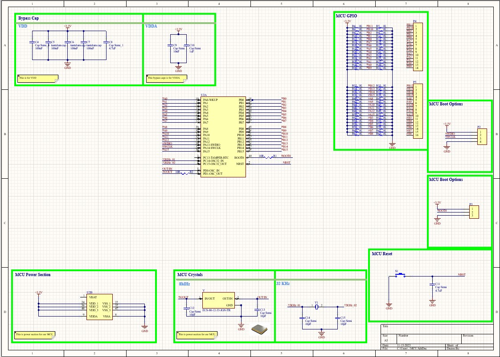
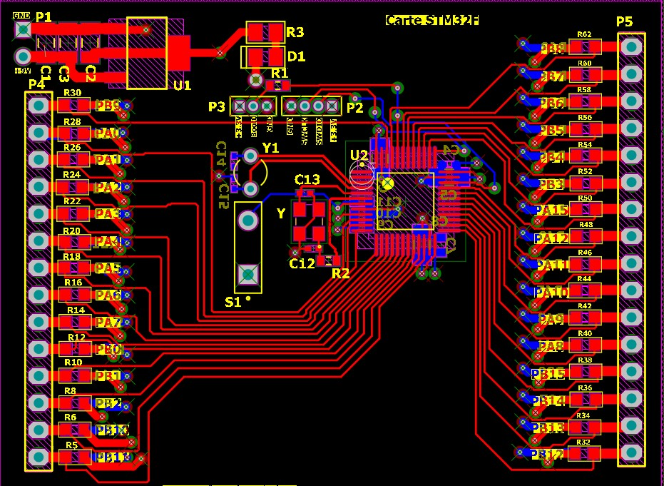
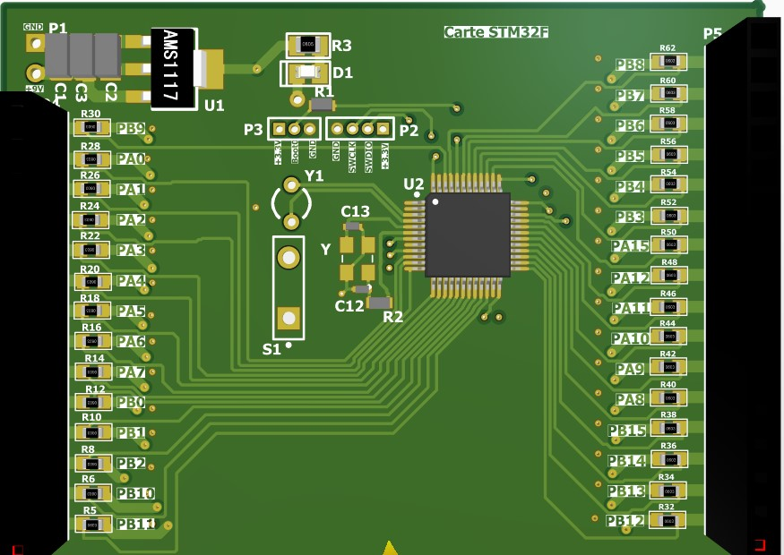

# Project PCB STM32F board

The PCB board is based on an STM32F microcontroller. It's similar to the ST Microelectronics Nucleo, which also features an STM32F. 

The board was realized on Altium Designer. It was produced by prototypist PCBway. This is a 4-layer PCB (top layer, GND layer, 3.3v layer and bottom layer) using vias.

*Project duration: 3 days*

# Table of contents
- [Electronic diagram](#eletronic-diagram)
- [Routage de la Carte PCB](#routage-de-la-carte-pcb)
  

## Electronic diagram

The board's circuit diagram includes a two-pin male connector for the external power supply. This allows the board to be powered from 4 to 20 volts. A voltage regulator is used to convert the input voltage to 3.3V.

The middle of the page shows the STM32F microcontroller. It has 43 pins, 30 of which are GPIOS controllable. This board use an external quartz oscillator to provide a stable frequency for this board.
The Reset pin on the microcontroller is connected to a pushbutton to reset the STM32F board.The STM32F has different boot options. The user is given the choice with a male connector.
The STM32F board has a JTAG (Joint Test Action Group) interface for testing, debugging and programming this board.
The board has two female connectors for connecting components to the board's GPIO. There are 30 GPIOS usable on the STM32F board.

Each GPIO has a pull-up resistor.
The bypass capacitor (decoupling capacitor) is used on our board to stabilize the power supply to the components.

Its main role is to filter and eliminate the high-frequency electrical noise generated by these components.

For routing placement, the bypass capacitor is connected between the supply line and ground (GND) in the immediate vicinity of the component it supplies. 
Here is the complete circuit diagram:

 

## PCB Design

The PCB has been realized on Altium Designer. It has a dimension of 6.5 cm and a height of 5 cm.  The board's top layer contains most of the components. 

Here's the top layer view of the PCB:

 

Here is a 3d view of the PCB:

 

## Arduino Factory

 * [More details on this project](https://arduinofactory.fr/carte-pcb-stm32f/)
  

